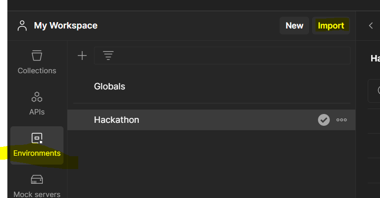
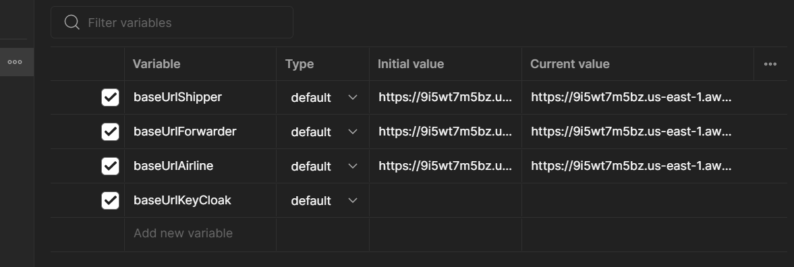

# IAM - ONE Record Workshop

Welcome to the IAM ONE Record Workshop, in this document you will find all the instructions to run a NE:ONE Server and a NE:ONE Play instance on your personal computer.

## Resources
- [Official ONE Record Repository](https://github.com/IATA-Cargo/ONE-Record)
- [API Specification](https://iata-cargo.github.io/ONE-Record/)
- [Ontology web version](https://onerecord.iata.org/ns/cargo/index-en.html)
- [Ontology TTL file](https://github.com/IATA-Cargo/ONE-Record/blob/master/2023-12-standard/Data-Model/IATA-1R-DM-Ontology.ttl) for a better ontology navigation open this file with a tool like Protegé.
- [Data Model](https://git-scm.com/downloads)

## Prerequisites

- [Docker](https://docs.docker.com/get-docker/) installed
- [Git](https://git-scm.com/downloads) installed (Git is installed by default on latest Mac OSX computers)
- [Protegé](https://protege.stanford.edu/download/protege/4.3/installanywhere/Web_Installers/) is optional. App to navigate the ontology TTL file

## Step by step guide

1) Clone the repository
   ```bash
   git clone https://github.com/alvastein/one-record-workshop.git
   ```
2) Switch to the directory to docker-compose
   ```bash
   cd one-record-workshop/docker-compose
   ```
3) Start all services with [docker compose](https://docs.docker.com/compose/)
   ```bash
   docker compose up -d
   ```
4) Wait until all containers are up and running:
   ```bash
   [+] Running 6/6
    ✔ Network docker-compose_default            Created 0.0s 
    ✔ Container docker-compose-graph-db-1       Healthy 0.0s 
    ✔ Container docker-compose-keycloak-1       Healthy 0.0s 
    ✔ Container docker-compose-ne-one-server-1  Started 0.0s 
    ✔ Container docker-compose-graph-db-setup-1 Started 0.0s
   ```
5) Try to access the ONE Record Server by  http://localhost:8080 using your favorite browser. 
   You should see a HTTP Error 401, because you did not authenticate yet. But this confirms that the ONE Record Server is up and running.

# Overview of services

| Name | Description | Base URL / Admin UI |
|-|-|-|
| ne-one server | [ne-one server](https://git.openlogisticsfoundation.org/wg-digitalaircargo/ne-one) | http://localhost:8080 |
| ne-one view | [ne-one view](https://git.openlogisticsfoundation.org/wg-digitalaircargo/ne-one-view) | http://localhost:3000 |
| ne-one play | [ne-one play](https://github.com/alvastein/neoneplay) | http://localhost:3001 |
| graphdb | GraphDB database as database backend for ne-one server | http://localhost:7200 |
| keycloak | Identity provider for ne-one server to authenticate ONE Record clients and to obtain tokens for outgoing requests. <br/> **Preconfigured client_id:** neone-client<br/> **Preconfigured client_secret:** lx7ThS5aYggdsMm42BP3wMrVqKm9WpNY  | http://localhost:8989 <br/> (username/password: admin/admin)|

## Postman Collection

To have you up and running we prepared a Postman collection. You will need to install Postman or a compatible software in order to use it.

1. [Download the Postman Collection here.](./assets/postman/Hackathon.postman_collection.json) It will open a new github page, use the download button to get the file

2. [Download the Postman Environment here](./assets/postman/Hackathon.postman_environment.json). It will open a new github page, use the download button to get the file

3. Import the Environment in Postman



4. Import the Collection in Postman


5. In the Environments tab, select Hackathon environment and set the baseUrlKeyCloak to http://localhost:8989.



6. Set the baseUrlShipper,baseUrlForwarder and baseUrlAirline to http://localhost:8080.


7. Select Collections on the right menu and open the Hackathon collection already imported

8. Use the Token Request call to generate and access token


9. Copy the access token (it might be a long string, please copy the full content) in the Authorization tab of the Get ServerInformation and run the call


10. If everything is setup correctly, you will see the server information of the AWS server

11. Copy the access token in Authentication tab of the Example Workflow folder

12. Run the calls one by one to create the objects. The order is important as each call is connected to the previous one.

## Add NE:ONE server into NE:ONE Play

1. Connect to NE:ONE Play http://localhost:3001 

2. Click on the setting button in the top-right corner (cog icon)

3. Add your server following this instruction:

    - Organization Name: <Choose a name (any string is accepted)>
    - Protocol: http
    - Host: http://localhost:8080  
    - Token : <Use the postman collection to generate a token and copy it here (follow the previous paragraph)>
    - Color : pick up a random color

    

4. Now you can start using NE:ONE Play. 

