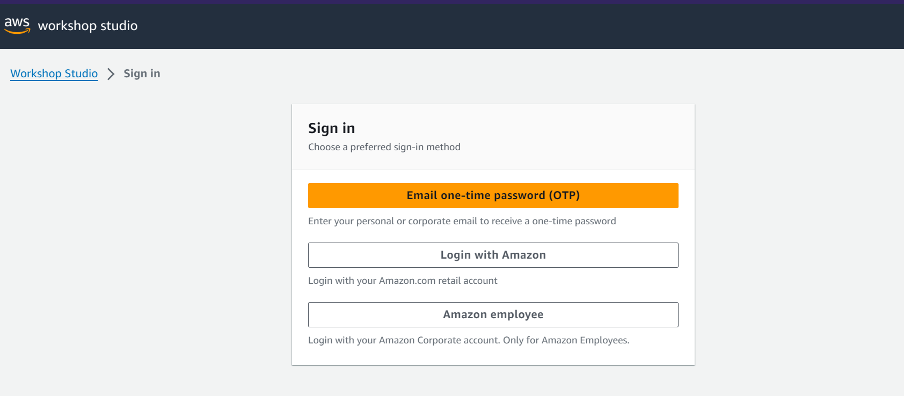
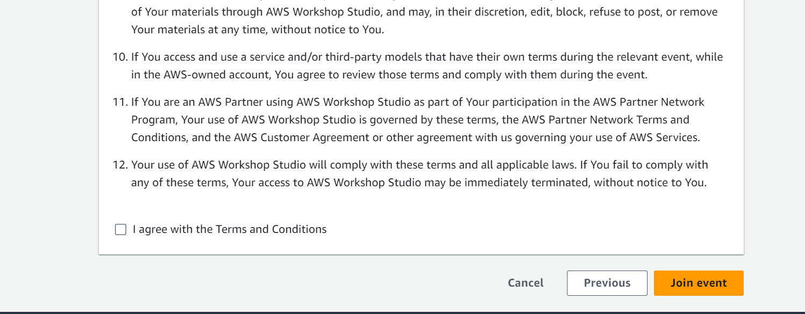
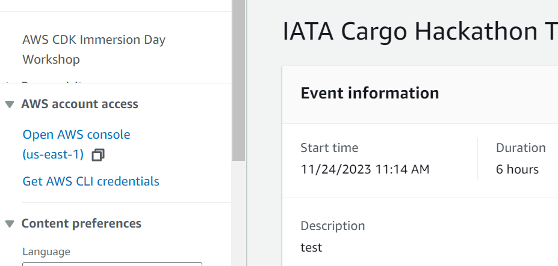
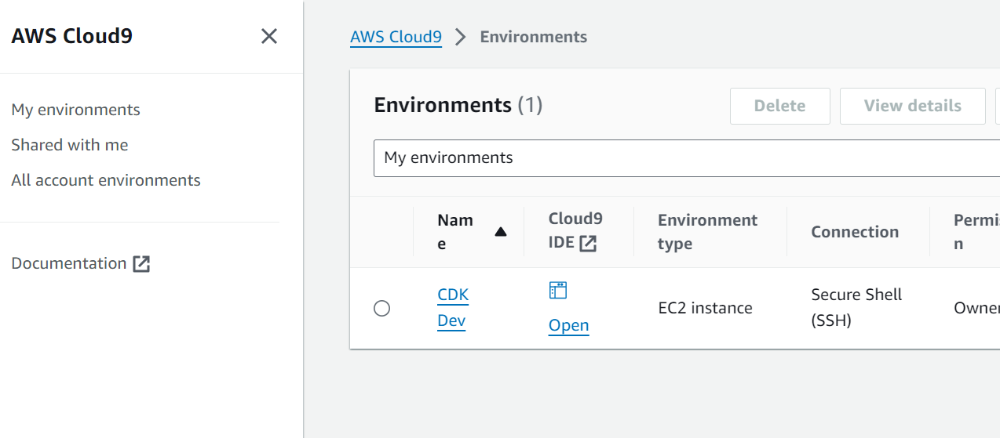
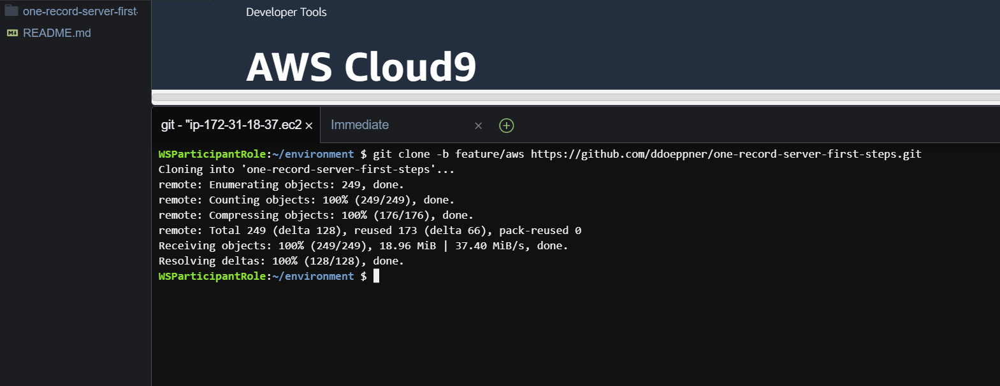
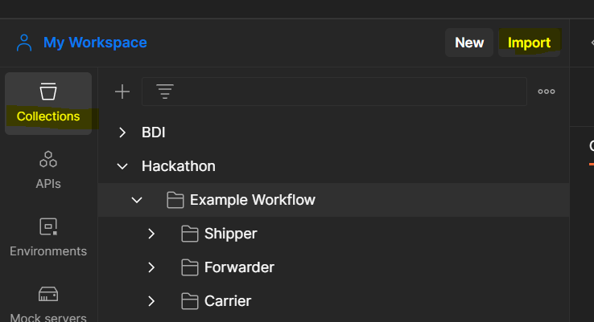
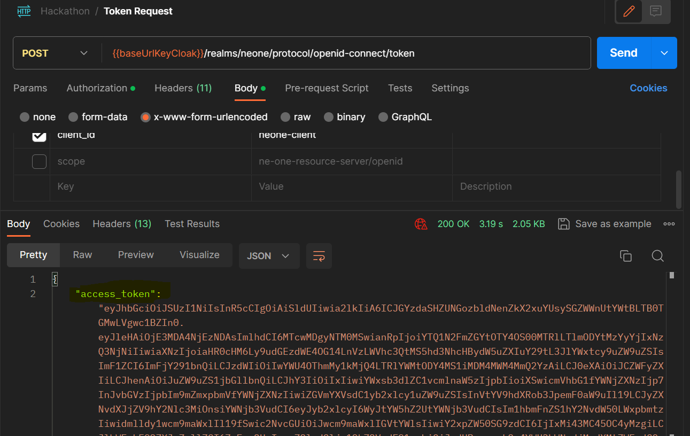
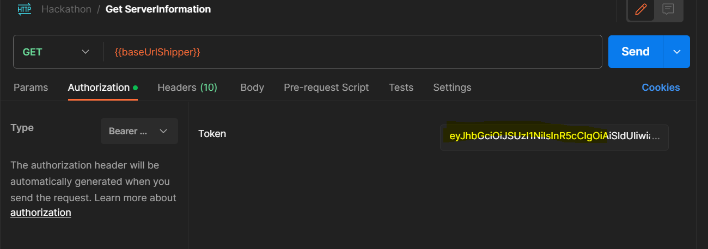
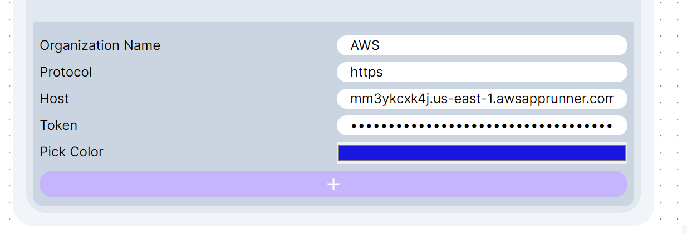
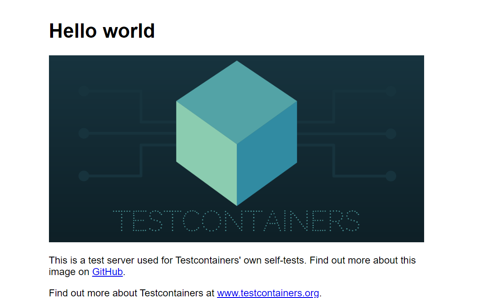

# ONE Record Hackathon

Welcome to the ONE Record Hackathon, in this document you will find all the instructions to run a NE:ONE Server and a NE:ONE Play instance on AWS

## Join the AWS event

To use the AWS services you will need to join the AWS Event.

1. Connect to the followint link : 

2. Request a ONE Time Password with the email you used to register for the hackathon



3. Scroll at the and of the page, Accept the terms and conditions and click on "Join event"



## AWS NE:ONE Setup

In order to create a NE:ONE server on AWS, please follow the next steps:

1. After join the event you will be redirect to the page of the event

2. On the left menu click on "Open AWS console"



3. Now you have access the AWS console, from here you can check all AWS tools.

4. Seach APP Runner and click on it. Check if a service is already running. In case something is running already **please use the servers without creating a new one**. Jump to the last step of the guide (step 10). If you enter in Cloud 9 and a script is already running **Please wait the end and jump to the last step, someone is already deploying server for you**

5. Search Cloud 9 in the search bar at the top, and click on it


6. In the Cloud 9 page, click "Open" under "Cloud9 IDE" 



7. Once Cloud 9 is started, use the terminal at the bottom to run the following commands:

``` 
git clone -b feature/aws https://github.com/ddoeppner/one-record-server-first-steps.git
cd one-record-server-first-steps/deployment
chmod +x deploy.sh
./deploy.sh
```



8. Wait around 20/30 minutes until the deployment finished

9. Once the deployment is finished (the terminal becomes available), go back to the AWS console. Search for APP Runner and click on it. 


10. In APP Runner you will find two running containers
    - neoneserverapp_dev : In the default domain you will find the address of the NE:ONE Server
    - neoneauthapp_dev : In the default domain you will find the address of the Key cloak Server


11. When using the default domain please add always :443 at the end.
    
## AWS NE:ONE Play Setup

In order to create a NE:ONE Play instance on AWS, please follow the next steps:

1. Seach APP Runner and click on it. Check if a service is already running. In case something is running already **please use the servers without creating a new one**. Jump to the last step of the guide. If you enter in Cloud 9 and a script is already running **Please wait the end and jump to the last step, someone is already deploying server for you**
 
3. Follow the NE:ONE server guide until Cloud 9 is started (step 5)

4. Once Cloud 9 is started, use the terminal at the bottom to run the following commands:

``` 
git clone -b feature/aws https://github.com/aloccid-iata/neoneplay
cd neoneplay/deployment
chmod +x deploy.sh
./deploy.sh
```

4. Wait around 20/30 minutes until the deployment finished

5. Once the deployment is finished, go back to the AWS console. Search for APP Runner and click on it.


6. In APP Runner you will find a running container:

    - neoneplayapp_dev : In the default domain you will find the address of the NE:ONE Play instance


7. Copy the address in your browser to start NE:ONE Play (it might takes few seconds at the first start)

## Postman Collection

To have you up and running we prepared a Postman collection. You will need to install Postman or a compatible software in order to use it.

1. [Download the Postman Collection here.](./assets/postman/Hackathon.postman_collection.json) It will open a new github page, use the download button to get the file

2. [Download the Postman Environment here](./assets/postman/Hackathon.postman_environment.json). It will open a new github page, use the download button to get the file

3. Import the Environment in Postman


4. Import the Collection in Postman



5. In the Environments tab, select Hackathon environment and set the baseUrlKeyCloak to the default domain of the neoneauthapp_dev of the APP Runner.


6. Set the baseUrlShipper,baseUrlForwarder and baseUrlAirline to the to the default domain of the neoneserverapp_dev of the APP Runner. **Please add ':443' ad the end of the host** (i.e. host:443) and remove the **/** at the end.


7. Select Collections on the right menu and open the Hackathon collection already imported

8. Use the Token Request call to generate and access token



9. Copy the access token (it might be a long string, please copy the full content) in the Authorization tab of the Get ServerInformation and run the call



10. If everything is setup correctly, you will see the server information of the AWS server

11. Copy the access token in Authentication tab of the Example Workflow folder

12. Run the calls one by one to create the objects. The order is important as each call is connected to the previous one.

## Add NE:ONE server into NE:ONE Play

1. Copy the default domain of the container called "neoneplayapp_dev" in APP Runner

2. Paste the domain in your browser to start NE:ONE Play

2. Click on the setting button in the top-right corner (cog icon)

3. Add your server following this instruction:

    - Organization Name: <Choose a name (any string is accepted)>
    - Protocol: https
    - Host: <Use the default domain of neoneserverapp_dev in APP Runner followed by **:443** (i.e. mm3ykcxk4j.us-east-1.awsapprunner.com:443)>  
    - Token : <Use the postman collection to generate a token and copy it here (follow the previous paragraph)>
    - Color : pick up a random color

    

    - Now you can start using NE:ONE Play. 

## Issues

If one of the container shows the Hello world container, please run the ./deploy.sh again. Something went wrong in the deployment of the actual resources



